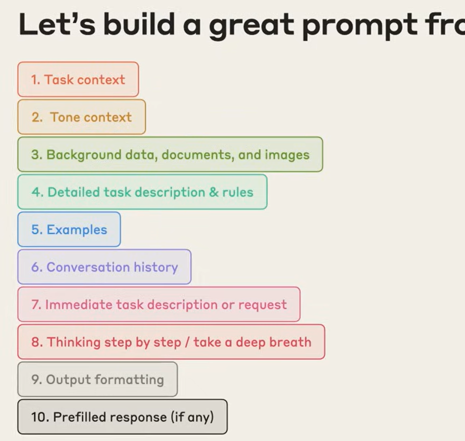
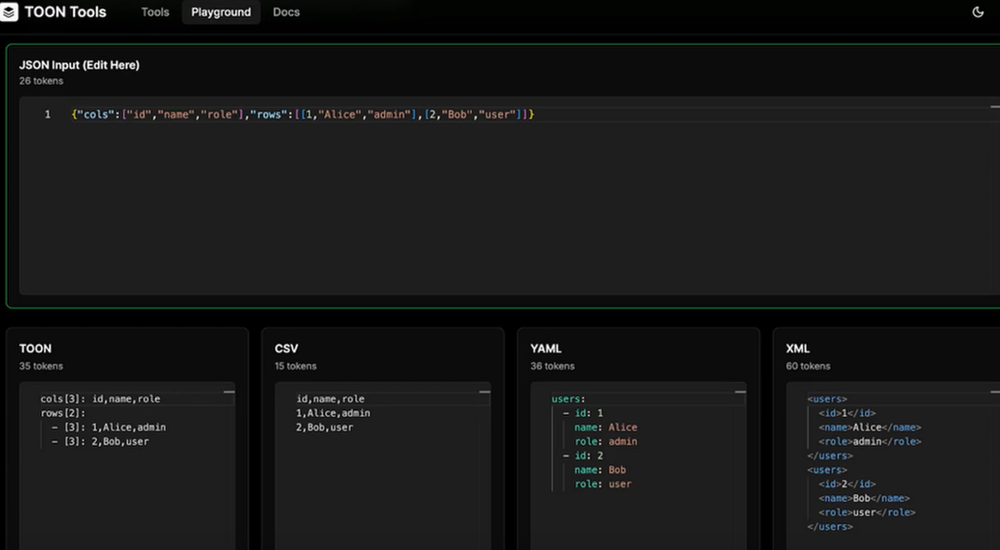

# Prompt Structure
1. Task Context
2. Tone Context
3. Prior data, documents and images
4. Detailed description of the task and rules
5. Example
6. Chat History
7. Request/Question
8. Output format



## Refs
https://www.youtube.com/watch?v=ysPbXH0LpIE

# JSON Prompt
## Advantages
- predictable/structured output
- version control
- generally, token cheaper than conventional text prompt

## Cons
- Not very useful for casual conversations

## Tips
- Validate the output with some schema validator -> e.g. Zod
- Version prompts -> use `meta.version`
- Use verbose/obvious key names
- Use only relevant key/data

```json
{
  "meta": {
    "name": "task-name",
    "version": 1.0,
    "language": "en-US"
  },
  "role": "You are specialist of something",
  "context": {
    "audience": "students",
    "docLinks": [],
    "images": []
  },
  "task": {
    "goal": "This is the objective of this task",
    "type": "summary",
    "steps": []
  },
  "constraints": {
    "do_not_invent": false,
    "if_missing_data": "say_you_dont_know",
    "be_concise": true,
    "max_words": 250,
    "max_topics": 7,
    "uncertainty_policy": "if you are not certain, say you don't have enough information and ask for the missing info"
  },
  "output": {
    "format": "json",
    "schema": {
      "title": "string",
      "summary": "string",
      "topics": "string[]",
      "examples": "string[]"
    }
  }
}
```

# TOON (Token Oriented Object Notation)
- More token efficient
- Cheaper
- LLM Context Limit

## Considerations
- Sometimes you might not need TOON and can just improve your JSON structure:
- Many LLMs have been trained with massive amounts of JSON data
- Avoid repetitions in JSON (e.g. object arrays)
  


## Refs
6 - Módulo - Prompt Engineering na prática
6.1 - Como escrever prompts que realmente geram boas respostas
https://youtu.be/ysPbXH0LpIE
https://platform.openai.com/tokenizer
https://platform.openai.com/docs/guides/prompt-engineering
https://www.anthropic.com/engineering/effective-context-engineering-for-ai-agents
https://platform.claude.com/docs/en/build-with-claude/prompt-engineering/claude-4-best-practices
https://docs.lovable.dev/prompting/prompting-debugging
6.2 - Padrão TOON e JSON para prompts
https://github.com/toon-format/toon?tab=readme-ov-file
https://mpgone.com/json-prompt-guide/
https://apidog.com/pt/blog/json-format-prompts-pt/
https://medium.com/data-science-in-your-pocket/toon-bye-bye-json-for-llms-91e4fe521b14
https://github.com/toon-format/toon
https://toontools.vercel.app/playground
https://www.linkedin.com/posts/webai_toon-json-mcp-activity-7395932385500069888-vgRC?utm_source=share&utm_medium=member_desktop&rcm=ACoAABS1ckYBm0_ZMP8TT2e4opa3bFMxTRxyJ3w
https://www.linkedin.com/posts/pawel-huryn_how-to-format-data-in-prompts-for-llms-and-activity-7397245245299761152-VGHQ
