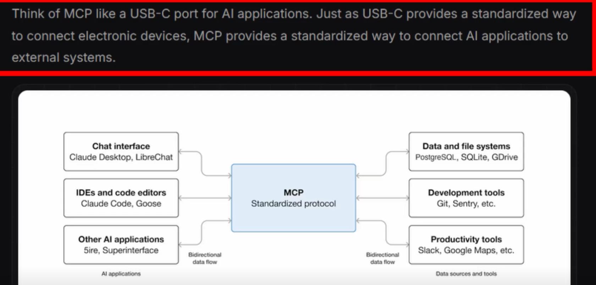

# MCP



## Tools
List of tools available. Like actions you can do with the MCP
e.g. `get_talks`, `check_status`, `schedule_meeting`

## Resources
Context data.
To know which MCP has more relation/meaning with the user request.


## Prompts
List of possible prompts the AI can use.

## How AI decides what MCP it should call?
Based on the context user provided it tries to match with relevant info of the MCP like:
- name and description of the tools
- parameters format (e.g. query -> MCP database, path -> MCP filesystem)
- cost and risk
- iterations
  - e.g. get a list of sales for me?
  - MCP database -> get list of tables -> match with sales -> query list of items of that table

## mcp.json
```json
This was the way i was able to run with WSL
{
  "servers": {
    "erickwendel-contributions": {
      "type": "stdio",
      "command": "npx",
      "args": [
        "-y",
        "@erickwendel/contributions-mcp"
      ]
    },
    "cwd": "${workspaceFolder}"
  }
}
```

## Refs

8 - Módulo - MCPs e automação para devs
8.1 - O que são MCPs (Model Context Protocol) e como conectam IA com APIs/serviço
Projeto em erickwendel-contributions-mcp/

https://www.anthropic.com/
https://www.anthropic.com/news/model-context-protocol
https://modelcontextprotocol.io/
https://cookbook.openai.com/examples/reasoning_function_calls
https://github.com/resend/mcp-send-email/tree/main
https://erickwendel.com.br/
https://tml-api.herokuapp.com/graphiql
8.2 - Usando IA para Gerar testes automatizados
Projeto em exemplo-06-playwright-testes/

https://github.com/microsoft/playwright-mcp
https://playwright.dev/docs/test-agents#agent-definitions
https://www.linkedin.com/feed/update/urn:li:activity:7381279589840433152/
8.3 - Usando IA para navegação
Projeto em exemplo-07-playwright-navegacao/

8.4 - Usando IA para consultar documentações atualizadas
Projeto em exemplo-08-context7/

https://github.com/upstash/context7#installation
https://github.com/ChromeDevTools/chrome-devtools-mcp
https://context7.com/
https://github.com/upstash/context7
https://context7.com/websites/nodejs_api
https://nextjs.org/
https://www.better-auth.com/
8.5 - Usando IA para colher dados de telemetria de apps
Projeto em exemplo-09-grafana-mcp/
